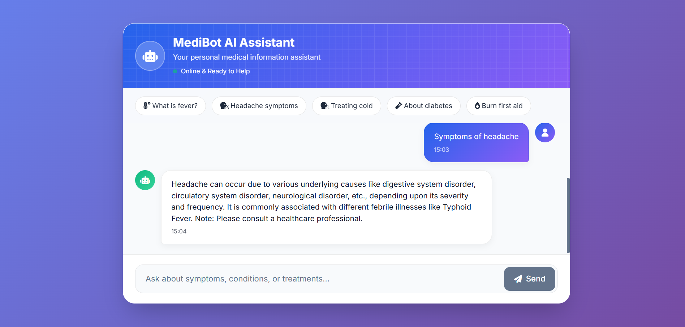

# Medical-Chatbot

# 🩺 MediAssist AI – Medical RAG Chatbot


> 🚀 An AI-powered **Retrieval-Augmented Generation (RAG) Medical Chatbot** that answers health-related questions using **medical textbooks**, ensuring factual, grounded, and human-friendly responses.

---

# 📌 Overview

**MediAssist AI** is a smart medical assistant that:

✅ Reads medical textbooks (PDFs)  
✅ Splits them into intelligent chunks  
✅ Converts text → vector embeddings  
✅ Stores knowledge in ChromaDB  
✅ Retrieves relevant context using semantic search  
✅ Generates clean, understandable answers using TinyLlama  

Unlike normal chatbots, this system:

❌ Does NOT hallucinate random answers  
❌ Does NOT depend on internet APIs  
✅ Uses textbook-grounded medical knowledge only  

---

# 🧠 RAG Architecture

```
Medical PDFs
     ↓
Smart Chunking
     ↓
Embeddings (HuggingFace)
     ↓
ChromaDB (Vector Store)
     ↓
Top-K Similar Chunks
     ↓
TinyLlama (LLM)
     ↓
Clean Human-Friendly Response
```

---

# ⚡ Key Features

## 🩺 Medical Intelligence
- Textbook-based answers
- Context-grounded generation
- Reduced hallucinations
- Clear, simple explanations
- Safe + professional tone

## 🤖 AI & Backend
- Local LLM (TinyLlama 1.1B)
- ChromaDB semantic search
- Retrieval-Augmented Generation (RAG)
- Deterministic outputs
- Fast local inference
- No API cost

## 🎨 Modern UI
- Glassmorphism design
- ChatGPT-style layout
- Typing animation
- Quick question pills
- Smooth scrolling
- Fully responsive
- 2026 modern SaaS look

# 📸 Sample Outputs

### Chat Interface


## 🚀 Performance
- Lightweight model
- Cached responses
- Small context window
- Sub-second retrieval
- Works fully offline

---

# 🛠️ Tech Stack

| Layer | Technology |
|--------|-------------|
| Language | Python |
| Backend | Flask |
| LLM | TinyLlama (Transformers) |
| Vector DB | ChromaDB |
| Embeddings | HuggingFace |
| Frontend | HTML + CSS (Modern Glass UI) |
| Architecture | RAG |

---

# 📂 Project Structure

```
Medical-Chatbot/
│
├── app.py                  # Flask server + RAG pipeline
├── chroma_db/              # Vector database
├── data/                   # Medical textbook PDFs
├── src/
│   └── helper.py           # PDF loader + chunking + embeddings
│
├── templates/
│   └── chat.html           # Chat interface
│
├── static/
│   └── style.css           # Modern glass UI styles
│
├── create_db.py            # Indexing script
└── README.md
```

---

# ⚙️ Installation

## 1️⃣ Clone Repository
```bash
git clone https://github.com/your-username/medical-rag-chatbot.git
cd medical-rag-chatbot
```

## 2️⃣ Create Virtual Environment
### Windows
```bash
python -m venv venv
venv\Scripts\activate
```

### Mac/Linux
```bash
python3 -m venv venv
source venv/bin/activate
```

## 3️⃣ Install Dependencies
```bash
pip install -r requirements.txt
```

---

# 📚 Index Medical Books (Create Vector DB)

Place your PDFs inside:

```
data/
```

Then run:

```bash
python create_db.py
```

This will:
- Extract text from PDFs
- Split into chunks
- Generate embeddings
- Store vectors in ChromaDB

---

# ▶️ Run Application

```bash
python app.py
```

Open browser:

```
http://localhost:8080
```

---

# 💬 Example Queries

Try asking:

- What is fever?
- Causes of typhoid?
- Symptoms of malaria?
- Treatment for dehydration?
- What is hypertension?
- Explain anemia simply

---

# 🧪 How It Works (Step-by-Step)

### Step 1 — Ingestion
Load medical textbooks (PDFs)

### Step 2 — Chunking
Split into smaller overlapping sections

### Step 3 — Embedding
Convert chunks → vector representations

### Step 4 — Storage
Store vectors inside ChromaDB

### Step 5 — Retrieval
Find most relevant chunks using semantic similarity

### Step 6 — Generation
TinyLlama answers using only retrieved context

### Step 7 — Cleaning
Post-process → human-friendly output

---

# 📊 Why RAG Instead of Normal Chatbot?

| Normal LLM | MediAssist AI |
|-------------|----------------|
| Hallucinates | Grounded answers |
| Random internet info | Textbook knowledge |
| API dependent | Works offline |
| Expensive | Free local inference |
| Less reliable | Context-based responses |

---

# 🎨 UI Preview

Modern Glassmorphism Interface:

- Floating card layout
- Soft gradients
- Clean chat bubbles
- Typing indicator
- Sticky input bar
- Mobile responsive

Feels similar to:
👉 ChatGPT / Notion / Perplexity style apps

---

# 🔮 Future Improvements

- Streaming responses
- Source citations (page numbers)
- Voice input
- Dark mode toggle
- Multi-language support
- Hybrid search (BM25 + vector)
- Larger medical LLM
- Docker deployment

---

# 👨‍💻 Author

**Dharun Kumar V**  
Computer Science Engineering Student  
Full Stack Developer | AI | RAG Systems | ML  

---

# ⭐ Support

If you found this useful:

⭐ Star the repo  
🍴 Fork it  
🛠️ Contribute improvements  

---

# 📜 License

MIT License – Free to use and modify
>>>>>>> a88a97e8e54a7687e1352b8e710aba0a805d163a
